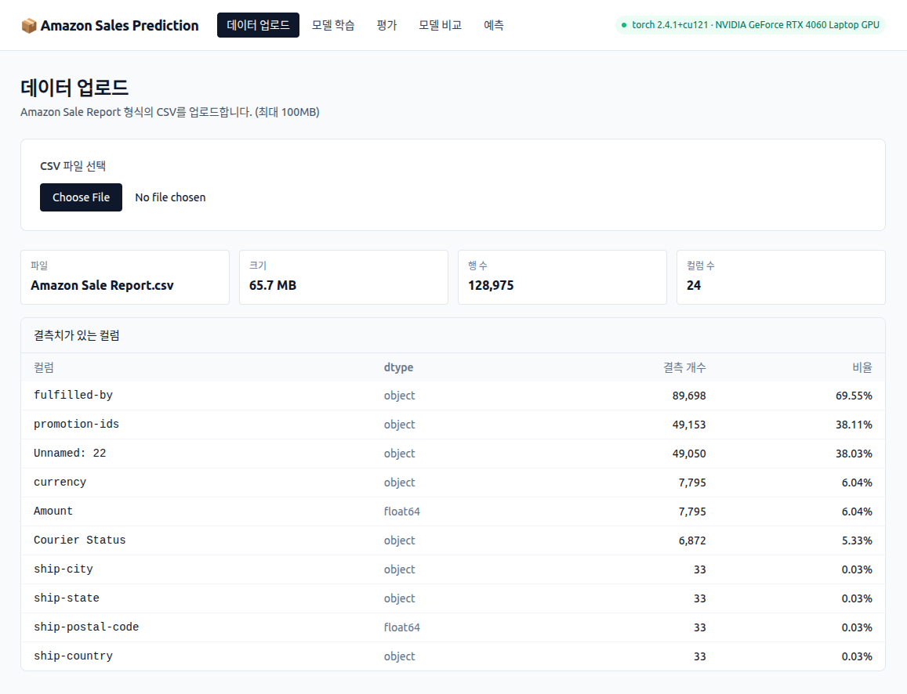

# Amazon E-Commerce Sales Prediction



Amazon 판매 데이터를 학습해 매출(Amount)을 예측하는 풀스택 ML 애플리케이션. PyTorch 기반 3종 회귀 모델(MLP / Residual / Attention)을 FastAPI로 서빙하고, Vue 3 SPA에서 업로드 → 전처리 → 학습 → 평가 → 예측 워크플로를 인터랙티브하게 사용합니다.

상세 설계 문서는 [`docs/ARCHITECTURE.md`](docs/ARCHITECTURE.md), 다이어그램은 [`docs/UML.md`](docs/UML.md) 참고.

---

## 핵심 기능

- **CSV 업로드 + 자동 요약** — 행/열, 결측치, dtype 통계
- **데이터 누수 방지 전처리 파이프라인** — fit은 train 분할에서만, transform은 모든 분할에서 (sklearn 컨벤션). 재사용을 위해 `preprocessor.pkl`로 직렬화
- **3종 PyTorch 모델 비교** — Basic MLP / Residual / Multi-head Attention
- **비동기 학습 잡 + 실시간 진행률** — 1.5s 폴링으로 손실 곡선·로그·에폭 진행도 라이브 반영
- **모델 평가 / 비교** — MAE · MSE · RMSE · R² + 산점도/잔차 시각화
- **단일 / 배치 예측** — 신규 CSV를 업로드해 학습 시 동일 전처리 적용 후 결과 CSV 다운로드

---

## 기술 스택

- **백엔드** — Python 3.10, FastAPI 0.115, Uvicorn, PyTorch 2.x, scikit-learn 1.3, pandas 2.x, matplotlib, seaborn
- **프론트엔드** — Vue 3 (Composition API), TypeScript, Vite 5, Pinia 2 (+ persistedstate), Vue Router 4, Tailwind 3, ECharts 5, axios
- **영속화** — 파일 시스템(`.npy`, `.pkl`, `.pth`, `.json`). DB 미사용

---

## 데이터셋

- **출처**: [Kaggle — E-Commerce Sales Dataset](https://www.kaggle.com/datasets/thedevastator/unlock-profits-with-e-commerce-sales-data)
- **파일**: `Amazon Sale Report.csv`
- **타깃**: `Amount` (회귀)

---

## 프로젝트 구조

```
amazon-sales-prediction/
├── README.md
├── docs/
│   ├── ARCHITECTURE.md            # 시스템 아키텍처
│   └── UML.md                     # Mermaid UML 다이어그램
├── backend/
│   ├── requirements.txt
│   ├── run_guide.sh
│   ├── Amazon Sale Report.csv     # Kaggle에서 다운로드 후 배치
│   ├── data_analysis.py           # EDA 스크립트
│   ├── data_preprocessing.py      # DataPreprocessor (fit/transform)
│   ├── model.py                   # SalesPredictor / Advanced / Attention
│   ├── train.py                   # SalesDataset, EarlyStopping, Trainer
│   ├── predict.py                 # Predictor + 평가/시각화 헬퍼
│   ├── utils.py                   # 시드, 디바이스, 결과 분석 유틸
│   ├── X_*.npy / y_*.npy          # 전처리 산출물 (자동 생성)
│   ├── preprocessor.pkl           # 학습된 전처리기 (자동 생성)
│   ├── models/{basic,advanced,attention}/
│   │   ├── best_model.pth
│   │   ├── config.json
│   │   └── training_history.png
│   ├── results/                   # 평가/시각화 산출물
│   └── app/                       # FastAPI 애플리케이션
│       ├── main.py                # 라우터 등록 + CORS + SPA fallback
│       ├── settings.py            # 경로/CORS/업로드 한도 상수
│       ├── schemas.py             # Pydantic 스키마
│       ├── api/                   # data, preprocess, train, predict 라우터
│       └── services/              # job_store, training/predict/dataset 서비스
└── frontend/
    ├── package.json
    ├── vite.config.ts             # /api → :8000 프록시
    └── src/
        ├── api/                   # axios 클라이언트 + 도메인별 호출 + OpenAPI 타입
        ├── components/            # StatCard, HealthBadge, LossChart, ScatterChart, MetricBarChart
        ├── stores/                # Pinia: dataset, training (jobId persisted)
        ├── views/                 # Upload, Train, Evaluate, Compare, Predict
        ├── router/                # vue-router (history 모드)
        ├── App.vue
        └── main.ts
```

> 모든 Python 명령은 `backend/` 디렉토리에서 실행합니다.

---

## 빠른 시작 (개발 모드)

터미널 두 개를 띄웁니다.

```bash
# Terminal 1 — 백엔드
cd backend
pip install -r requirements.txt
python -m uvicorn app.main:app --reload --port 8000 --workers 1

# Terminal 2 — 프론트엔드
cd frontend
npm install        # 최초 1회
npm run dev        # http://localhost:5173
```

브라우저에서 `http://localhost:5173`에 접속하면 Vite가 `/api/*` 요청을 8000번 백엔드로 프록시합니다.

OpenAPI 스키마가 변경되면 프론트 타입 재생성:

```bash
cd frontend
npm run gen:api    # → src/api/schema.d.ts
```

---

## 운영(빌드) 모드 — 단일 프로세스

프런트를 빌드해두면 FastAPI가 정적 자산까지 함께 서빙합니다 (포트 1개).

```bash
# 1) 프론트 빌드
cd frontend && npm run build       # → frontend/dist/

# 2) 백엔드 실행
cd ../backend
python -m uvicorn app.main:app --host 0.0.0.0 --port 8000 --workers 1
```

`http://localhost:8000` 한 곳에서:
- `/`, `/upload`, `/train`, `/predict` 등 SPA 라우트 → `index.html`
- `/api/*` → REST API (없는 경로는 404 JSON, SPA fallback 안 됨)
- `/assets/*`, `/openapi.json`, `/docs` → 정상 동작

---

## 환경 요구사항

- Python 3.10 권장 (검증 환경: `py310_pt`)
- Node.js 18+
- CUDA GPU (선택) — 학습 가속용. 없으면 자동으로 CPU 사용

권장 conda 환경:

```bash
conda create -n amazon-sales python=3.10 -y
conda activate amazon-sales
cd backend && pip install -r requirements.txt
```

검증 환경 버전:
```
python=3.10  torch=2.4.1+cu121  numpy=1.24  pandas=2.0  scikit-learn=1.3
```

---

## UI 워크플로

1. **Upload** — `Amazon Sale Report.csv` 업로드. 행/열, 결측치, dtype 요약 확인
2. **Train** — "전처리" 클릭 → 자동 분할(0.8/0.1/0.1) + `.npy` 산출 → 모델 타입·하이퍼파라미터 설정 후 학습 시작. 학습 중 손실 곡선/에폭/로그가 라이브 갱신
3. **Evaluate** — 학습된 모델 선택 후 `X_test`에 대한 MAE/MSE/RMSE/R² + 산점도 확인
4. **Compare** — 학습된 모든 모델을 동일 테스트셋으로 한 번에 비교 (메트릭 막대 차트, 베스트 모델 배지)
5. **Predict**
   - **Single**: 피처 벡터를 직접 입력해 단건 예측
   - **Batch**: 신규 CSV 업로드 → 학습 시 사용한 `preprocessor.pkl`로 동일 변환 → 결과 CSV 다운로드

---

## REST API 요약

- `GET  /api/health` — torch 버전 / CUDA 사용 가능 여부
- `POST /api/data/upload` — CSV 업로드 (multipart)
- `GET  /api/data/summary` — 활성 데이터셋 요약
- `POST /api/preprocess` — 전처리 실행 → train/val/test 분할
- `POST /api/train` — 학습 잡 비동기 시작
- `GET  /api/train/active` — 활성/최근 잡 (새로고침 복구용)
- `GET  /api/train/{job_id}` — 잡 상태 + 손실 이력
- `GET  /api/train/{job_id}/log?since=N` — 증분 로그 폴링
- `GET  /api/models` — 학습된 모델 목록
- `POST /api/predict/batch?model_type=...` — 테스트셋 평가
- `POST /api/predict/compare` — 모든 모델 비교 평가
- `POST /api/predict/single?model_type=...` — 단일 입력 예측
- `POST /api/predict/batch_csv?model_type=...` — CSV 배치 예측 (CSV 스트리밍 응답)

OpenAPI 문서: `http://localhost:8000/docs`

---

## CLI 사용 (선택)

UI 없이 백엔드 ML 코어만 사용할 수도 있습니다. 모두 `backend/`에서 실행합니다.

```bash
# 1) EDA
python data_analysis.py

# 2) 전처리 (X_*.npy / y_*.npy / preprocessor.pkl 생성)
python data_preprocessing.py

# 3) 학습
python train.py --model_type basic     --epochs 100 --batch_size 32 --lr 0.001
python train.py --model_type advanced  --epochs 100 --batch_size 32 --lr 0.001
python train.py --model_type attention --epochs 100 --batch_size 32 --lr 0.001

# 4) 예측/평가
python predict.py --model_path models/basic/best_model.pth
```

주요 학습 인자:

- `--model_type` (default `basic`) — basic / advanced / attention
- `--hidden_dims` (default `256 128 64`) — 은닉층 차원
- `--dropout` (default `0.3`) — 드롭아웃 비율
- `--epochs` (default `100`) — 에폭 수
- `--batch_size` (default `32`) — 배치 크기
- `--lr` (default `0.001`) — 학습률
- `--weight_decay` (default `1e-5`) — L2 정규화
- `--patience` (default `15`) — EarlyStopping patience
- `--seed` (default `42`) — 랜덤 시드

---

## 모델 아키텍처

### 1) Basic — `SalesPredictor`
```
Input → [Linear → BN → ReLU → Dropout] × N (default 256→128→64) → Linear → Output
```
간단·빠름. 회귀 베이스라인.

### 2) Advanced — `AdvancedSalesPredictor`
```
Input → Linear(hidden) → ResidualBlock × N → Linear → Output
```
스킵 커넥션으로 깊은 네트워크 학습 안정화 (gradient vanishing 완화).

### 3) Attention — `AttentionSalesPredictor`
```
Input → Embedding → MultiheadAttention → +Residual → LayerNorm
      → FFN → +Residual → LayerNorm → Output
```
피처 간 관계를 self-attention으로 학습.

세 모델 모두 `model.py`의 `get_model(model_type, input_dim, **kwargs)` 팩토리로 생성됩니다.

---

## 전처리 파이프라인

`backend/data_preprocessing.py`의 `DataPreprocessor`가 sklearn 스타일 fit/transform을 따릅니다.

1. 불필요 컬럼 제거 (ID, 노이즈)
2. 타깃 결측 행 제거 → 취소 주문(Amount=0) 필터
3. 날짜 피처 추출 (`year, month, day, dayofweek, quarter`)
4. **TRAIN 분할에서만 fit**: 결측 통계(median/mode), 카테고리 인코더(top-50, 나머지는 "Other"), `StandardScaler`
5. **모든 분할에 transform 적용** — 추론 시 `preprocessor.pkl`을 재로드해 동일 변환 보장

산출물: `X_train.npy / X_val.npy / X_test.npy` + `y_*.npy` + `preprocessor.pkl`. 분할은 **0.8 / 0.1 / 0.1**.

---

## 성능 지표

- **MAE** — 평균 절대 오차. 낮을수록 좋음.
- **MSE** — 평균 제곱 오차. 낮을수록 좋음.
- **RMSE** — 평균 제곱근 오차 (큰 오차에 민감). 낮을수록 좋음.
- **R²** — 설명력. 1에 가까울수록 좋음 (0.8↑ 매우 좋음, 0.6~0.8 좋음, 0.4~0.6 보통, <0.4 개선 필요).

평가 결과는 UI(Evaluate/Compare 화면)와 `backend/results/evaluation_results.json` 양쪽에서 확인할 수 있습니다.

---

## 동시성과 운영 주의사항

- 학습 잡은 `JobStore`(인메모리)로 관리되며 **동시 학습 1개**만 허용됩니다 (GPU·matplotlib 전역 상태 보호).
- 프로세스 재시작 시 잡 이력이 초기화됩니다 (DB 미사용).
- Uvicorn은 `--workers 1`로 실행하세요. 멀티 워커는 인메모리 잡 상태와 호환되지 않습니다.
- 업로드 한도 100 MB (`MAX_UPLOAD_BYTES` in `app/settings.py`).

---

## 트러블슈팅

- **CUDA OOM** → `--batch_size`를 16 등으로 축소, 또는 `--hidden_dims 128 64`로 모델 축소
- **학습 속도 느림** → GPU 메모리 충분 시 `--batch_size 128`, 또는 `--epochs 50`
- **Overfitting** → `--dropout 0.5`, `--weight_decay 1e-4`, `--patience 10`
- **Underfitting** → `--hidden_dims 512 256 128 64`, `--dropout 0.2`, `--lr 0.0005`
- **`/api/data/summary` 404** → 아직 업로드한 데이터셋이 없음. UI Upload 또는 `POST /api/data/upload` 먼저
- **배치 예측 컬럼 불일치** → 학습 시 사용한 `preprocessor.pkl`과 다른 스키마. 동일한 컬럼 셋의 CSV 업로드 필요
- **새로고침 후 학습 화면 빔** → `localStorage`의 `jobId`로 복구 시도. `GET /api/train/active`로도 복구 가능

---

## 참고 문서

- 시스템 아키텍처: [`docs/ARCHITECTURE.md`](docs/ARCHITECTURE.md)
- UML 다이어그램(Mermaid): [`docs/UML.md`](docs/UML.md)
- API 스키마(자동 생성): `http://localhost:8000/docs` 또는 `http://localhost:8000/openapi.json`

---

## 라이선스

[`LICENSE`](LICENSE) 파일 참조.
