# UML — Amazon Sales Prediction

본 문서는 시스템의 정적/동적 구조를 Mermaid 기반 다이어그램으로 정리한다. (GitHub·VS Code·IntelliJ 모두 Mermaid 렌더링 지원)

- 클래스 다이어그램: ML 코어, 서비스, 프론트 스토어
- 컴포넌트 다이어그램: 백엔드/프론트 모듈 의존
- 시퀀스 다이어그램: 업로드, 전처리, 학습(폴링), 평가/예측
- 상태 다이어그램: TrainingJob 생명주기
- 유스케이스 다이어그램: 사용자 흐름

---

## 1. 클래스 다이어그램 — ML 코어 (`backend/`)

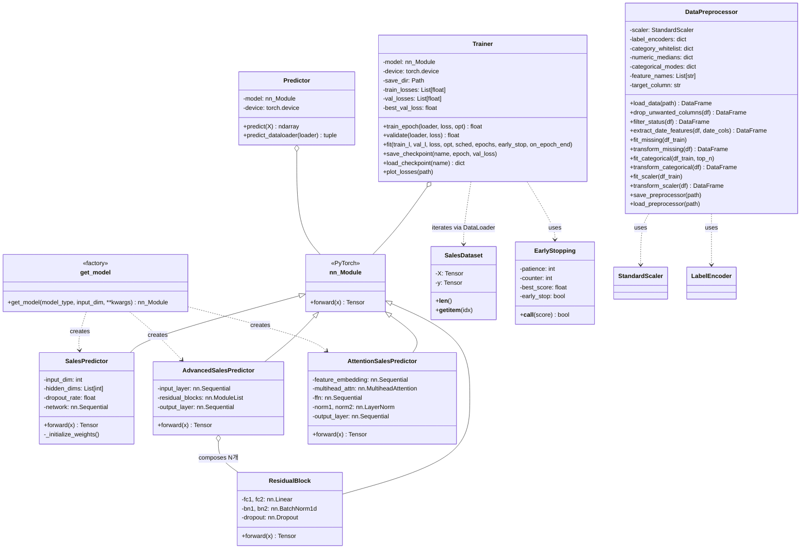

---

## 2. 클래스 다이어그램 — 서비스/잡 관리 (`backend/app/`)

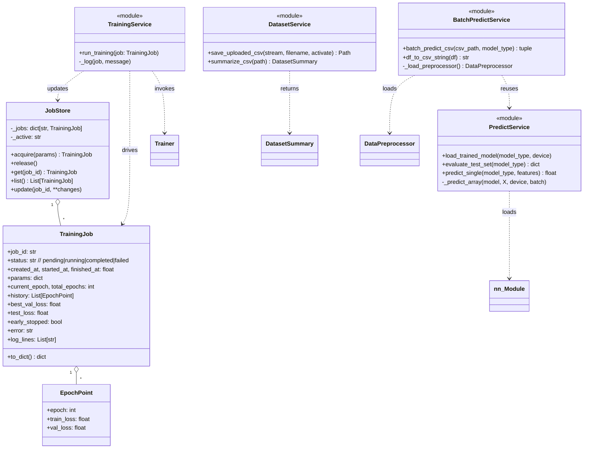

---

## 3. 클래스 다이어그램 — 프론트엔드 (Pinia/Views)

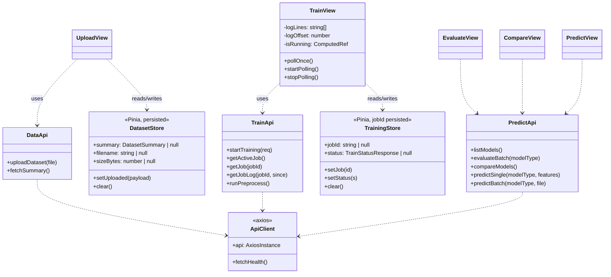

---

## 4. 컴포넌트 다이어그램 — 백엔드

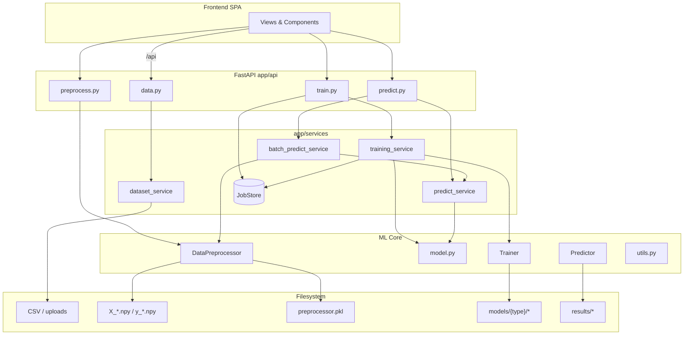

---

## 5. 컴포넌트 다이어그램 — 프론트엔드

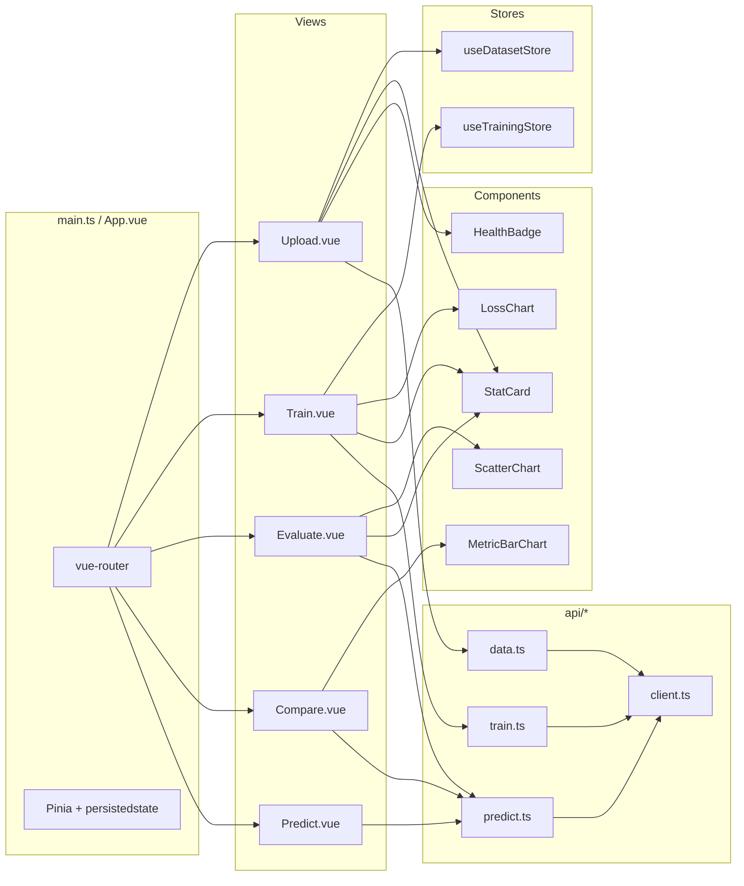

---

## 6. 시퀀스 다이어그램 — 데이터셋 업로드

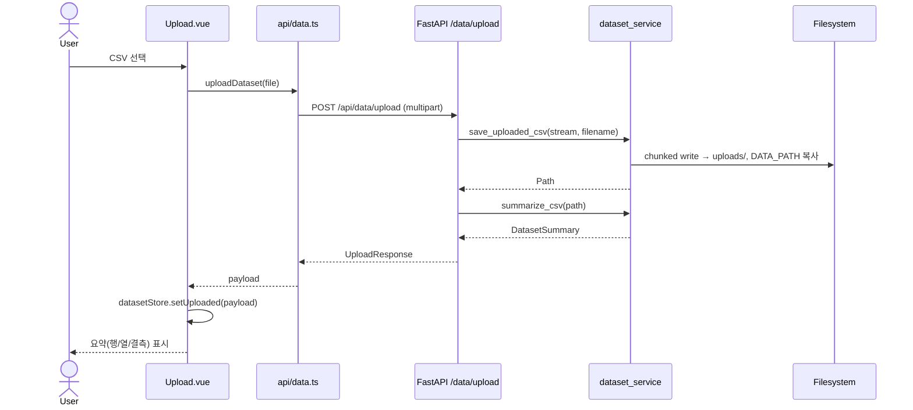

---

## 7. 시퀀스 다이어그램 — 전처리

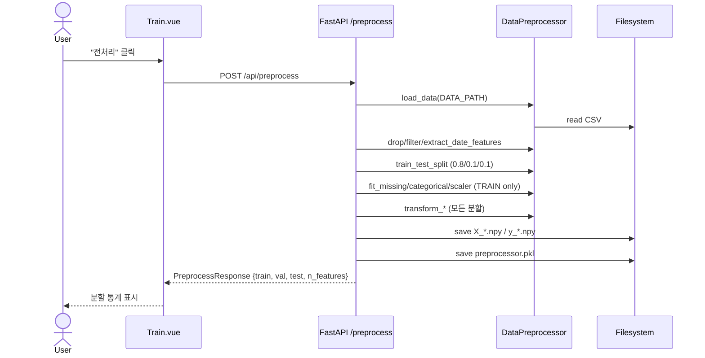

---

## 8. 시퀀스 다이어그램 — 학습 (비동기 + 폴링)

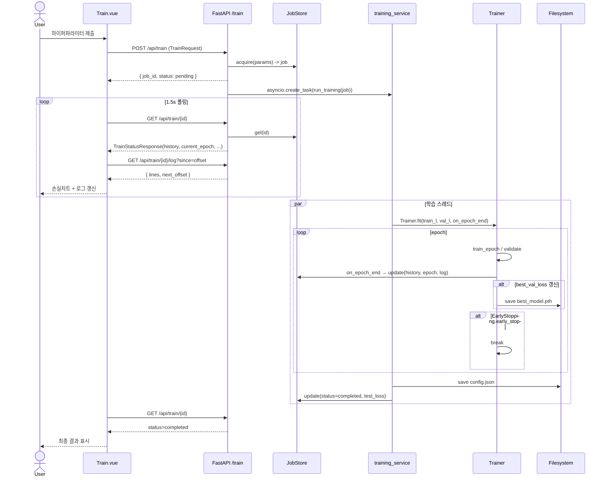

---

## 9. 시퀀스 다이어그램 — 평가 / 비교

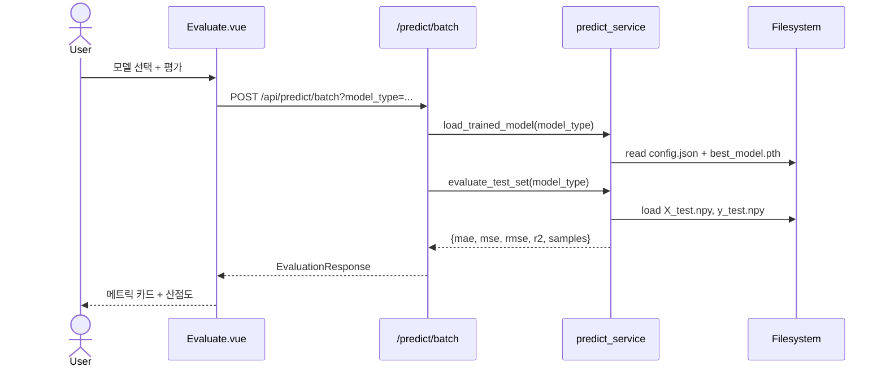

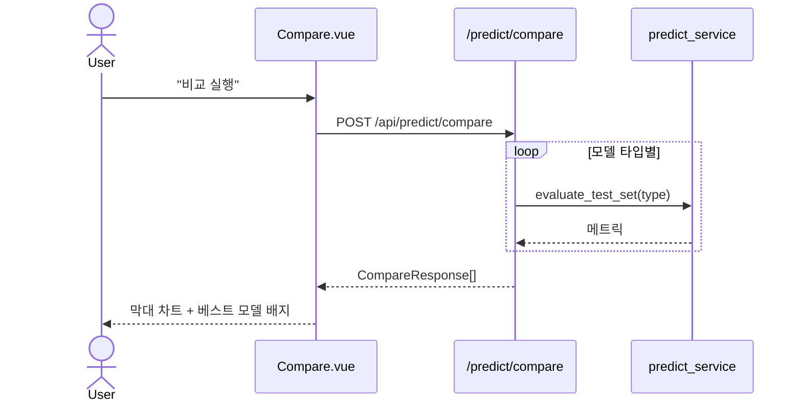

---

## 10. 시퀀스 다이어그램 — 단일/배치 예측

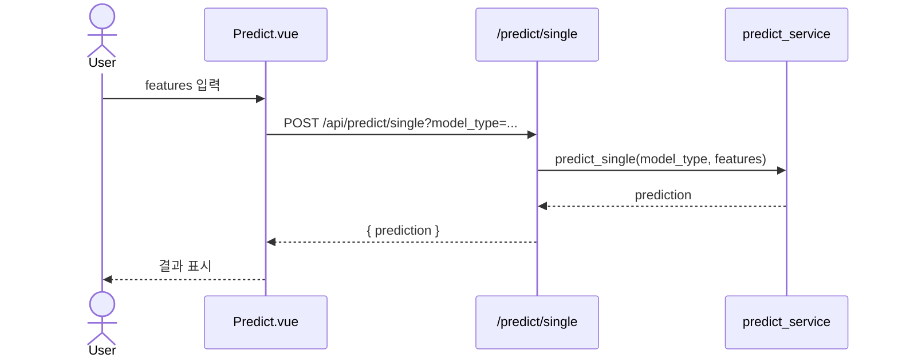

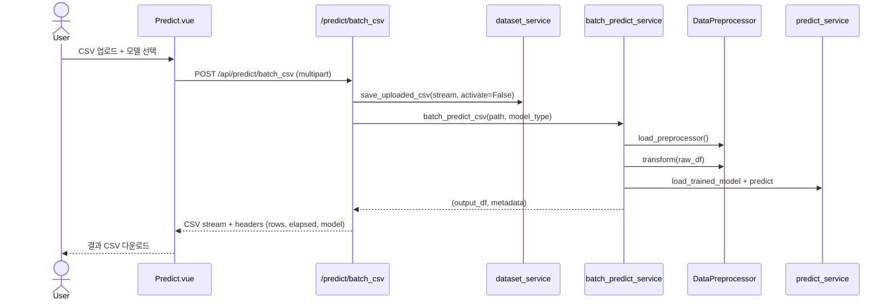

---

## 11. 상태 다이어그램 — TrainingJob

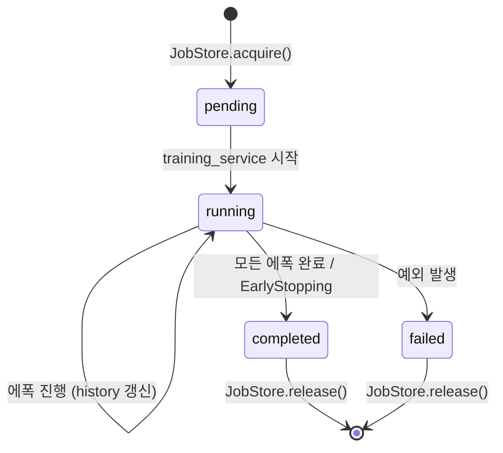

---

## 12. 유스케이스 다이어그램

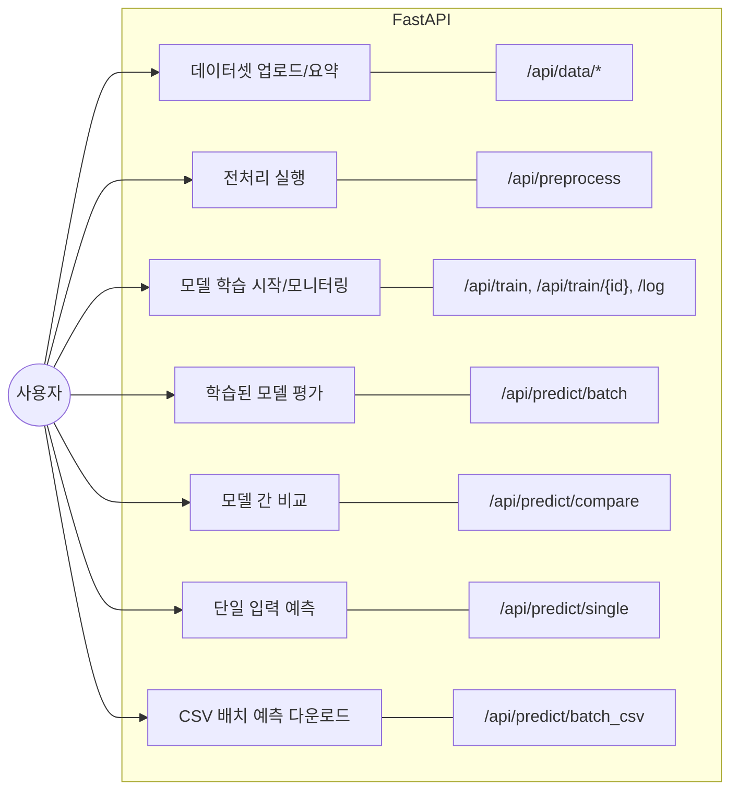

---

## 13. 핵심 객체 의존 요약 (한눈에 보기)

| 객체 | 의존 | 호출 주체 |
|------|------|----------|
| `Trainer` | `nn.Module`, `EarlyStopping`, `DataLoader` | `training_service.run_training` |
| `Predictor` | `nn.Module`, `DataLoader` | `predict_service`, `batch_predict_service` |
| `DataPreprocessor` | `StandardScaler`, `LabelEncoder` | `/preprocess` 라우터, `batch_predict_service` |
| `JobStore` | `TrainingJob`, `EpochPoint` | `/train` 라우터, `training_service` |
| FE `Train.vue` | `useTrainingStore`, `api/train.ts` | 사용자 폴링 루프 |
| FE `api/client.ts` | axios | 모든 도메인 API 모듈 |
